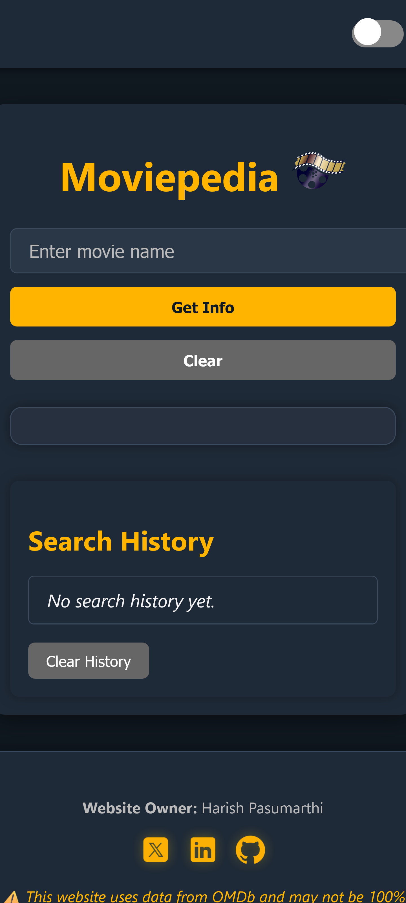
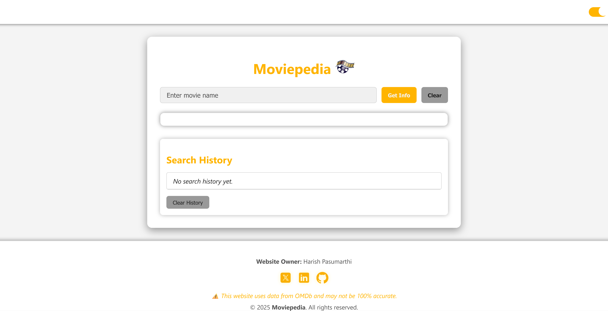
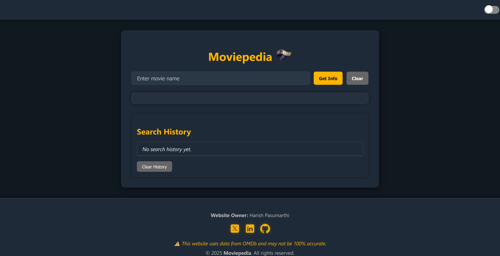
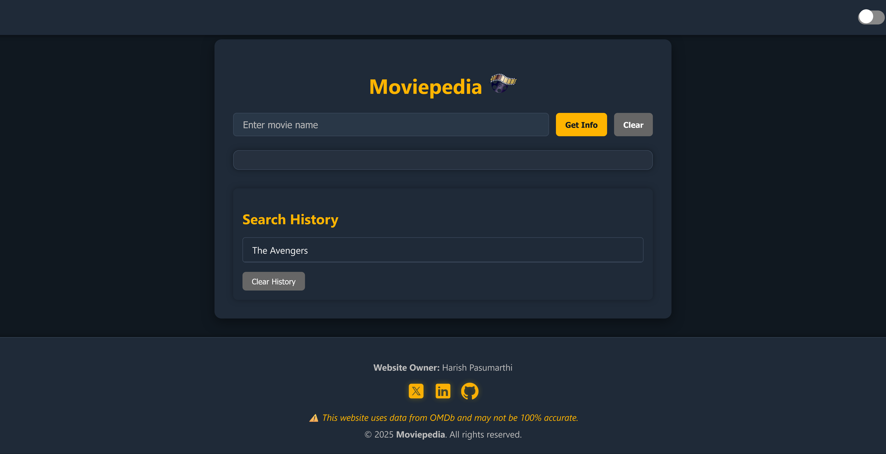

# 🎬 Moviepedia — Movie Search Web App  
**[🔗 Live Demo](https://moviepedia0.netlify.app/)**

> A clean, responsive movie search experience powered by the OMDb API.

**Moviepedia** is a single-page web app where users can explore detailed movie information in real time. It features a light/dark mode toggle, persistent search history, a mobile-responsive design, and smooth UI interactions — all powered by vanilla JavaScript and the OMDb API.

---

## 📸 Screenshots

| Home Page | Light Mode | Dark Mode |
|-----------|------------|-----------|
|  |  |  |

| Search History | Search History |
|----------------|----------------|
|  |  |

> *Screenshots show desktop view. The layout is fully responsive across all devices.*

---

## 🚀 Features

- 🔍 **Real-Time Movie Search** – Instantly fetch movie data via [OMDb API](https://www.omdbapi.com/)
- 🌗 **Theme Toggle** – Custom-built light/dark mode using CSS variables and JavaScript
- 🕓 **Persistent Search History** – Saved locally using `localStorage`
- ⚠️ **Error Handling** – Friendly feedback for invalid or empty search inputs
- 📱 **Responsive UI** – Works seamlessly on phones, tablets, and desktops
- 🧩 **Modular JavaScript** – Clean, maintainable code with separation of concerns

---

## 🧠 What I Learned

- Efficient use of `fetch()` with APIs
- Using `localStorage` to persist client-side data
- Designing accessible and theme-aware UIs with CSS variables
- Writing clean, reusable, and modular JavaScript code
- Responsive design principles using media queries and flexible layouts

---

## 🛠 Tech Stack

- **HTML5** – Semantic structure
- **CSS3** – Flexbox, variables, transitions, media queries
- **JavaScript (ES6+)** – DOM manipulation, modular code, async/await
- **OMDb API** – Open-source movie database for live data

---
